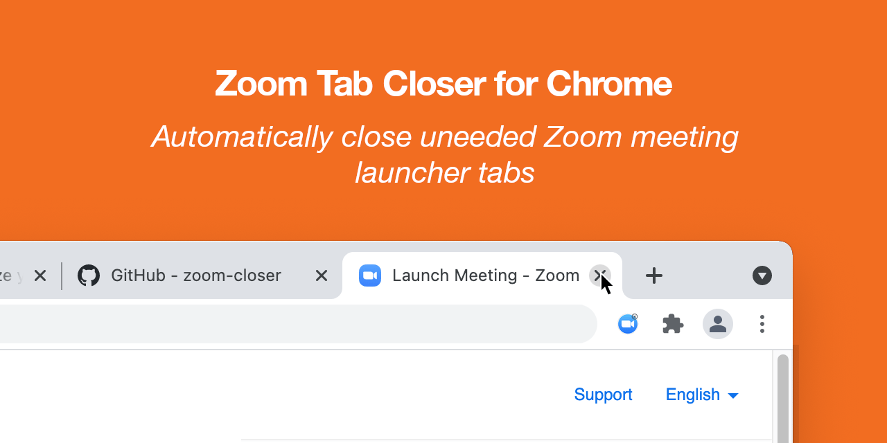

# Zoom Tab Closer

Automatically close Zoom meeting launch windows in Chrome after the meeting launches.

[Get it from the Chrome Web Store][1]



### Building

To package up for uploading to the Chrome Web Store:

```sh
zip zoom-closer.zip \
  --recurse-paths assets/icon-*.png background.js content.js manifest.json
```


### Credit

Forked from seanstar12 and updated to work with new Chrome permissions.

[1]: https://chrome.google.com/webstore/detail/zoom-closer/chdbpcoehkphnaefhmggpjfpjhocolfe
